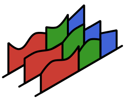

[//]: Logo
<p align="center">

</p>

# Integrated Residuals Solver
[//]: Badges
[](https://judo-dev.github.io/Interesso.jl/stable)
[](https://judo-dev.github.io/Interesso.jl/dev)
[](https://github.com/JuDO-dev/Interesso.jl/actions)
[](https://codecov.io/gh/JuDO-dev/Interesso.jl)

[//]: Description
Solves **Dynamic Feasibility** and **Dynamic Optimisation** problems (think Optimal Control) using an Integrated Residuals method.
## Installation

```julia
julia> ]
  pkg> add Interesso
```

## Example using solve()
```julia
using Interesso

dop = DOProblem();

solution = solve(dop, LeastSquares());
```

## Example using iterator()
```julia
using Interesso

dop = DOProblem();

I = DOIterator(dop, LeastSquares());

collect(I);
```